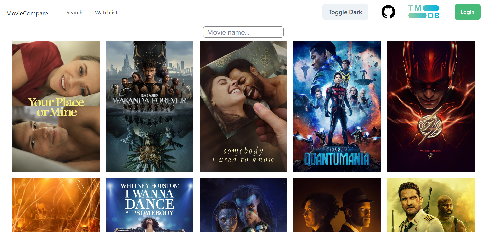
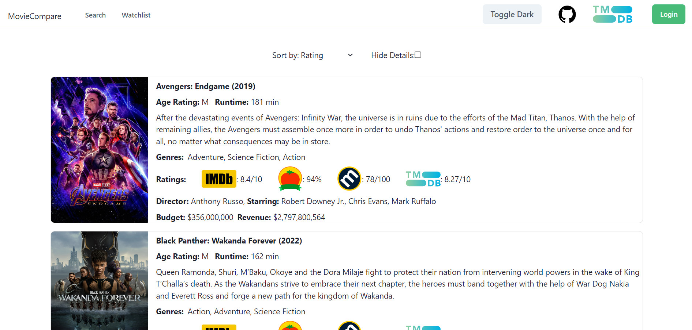
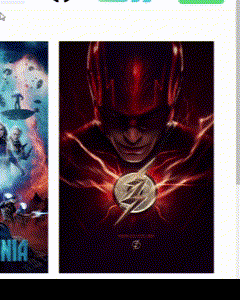
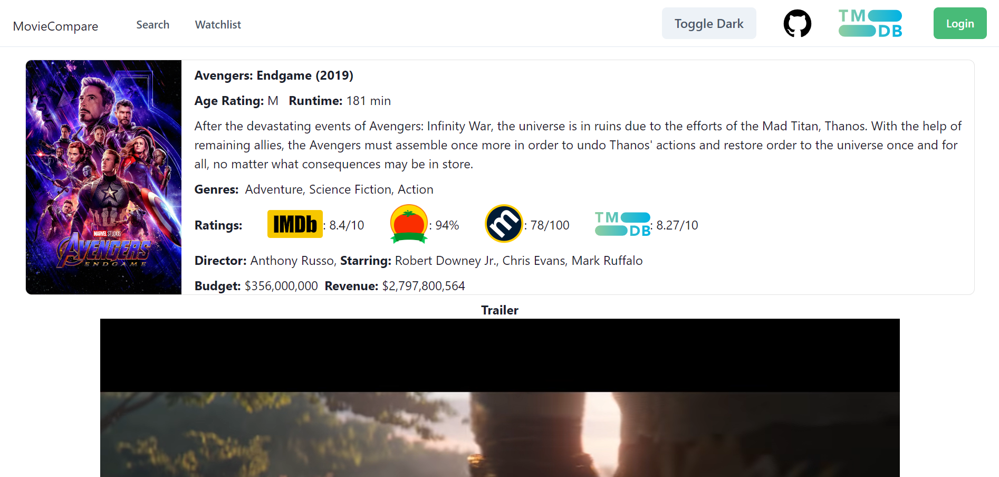
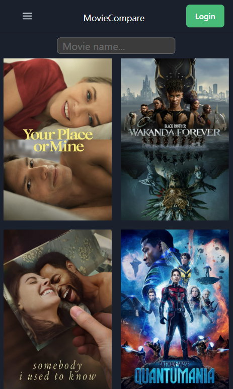

# MovieCompare

Use MovieCompare to find, save and compare your favourite movies instead of opening multiple tabs for trailers and ratings.

Compare movies saved to your watchlist using several stats and Movie Ratings (IMDB, Rotten Tomatoes, Metacritic and TMDB).
Watchlist is saved when users logs in, and their watchlist will automatically load the next time they return to this web app.

Users have the option to add/remove movies from their watchlist via hovering over the movie thumbnail

Finally, users can see more details about a movie by clicking on the 'Details' button. This will take you to a page with the movie trailer and cast.

## Additional Features
This web app is also Mobile Friendly and has Dark Mode included

This project was bootstrapped with [Create React App](https://github.com/facebook/create-react-app).